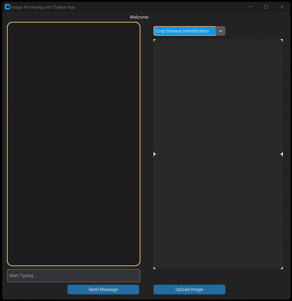

# AgriAppsCropChat

# Table of contents
1. [Introduction](#Introduction)
    1. [Disease Identification](#Disease_Identification)
    2. [Nutrient Deficiency](#Nutrient_Deficiency)
    3. [Plant Species Recognition](#Plant_Species_Recognition)
    4. [Flower Classification](#Flower_Classification)
2. [ChatBot Demo](#Demo)

# Introduction <a name="Introduction"></a>

An AI powered chatbot that runs computer vision models in inference on crop related diagnosis. It was created using customtkinter as the frontend user interface and currently  has four crop diagnosis applications: crop diseases, rice nutrient deficiencies, plant species, and flower species.
This AI chatbot can diagnose all four aforementioned problems only from images. The software architecture flowchart of the application is shown below.


* Create virtual environment

```bash
python -m venv crop_apps_env

# Windows
.\crop_apps_env\Scripts\activate

#Linux
source ./crop_apps/bin/activate
```

* Create file in root directory called api_key.txt, where you'll store your OpenAI API key.


## Disease Identification <a name="Disease_Identification"></a>
This mode gives back information on what kind of disease is on the crop as a label if at all present. The chatbot is also meant to answer what can be done about the disease if prompted.
  
Training Data: PlantDoc Image dataset
* Description: Dataset used for benchmarking classification models in the paper titled "PlantDoc: A Dataset for Visual Plant Disease Detection"
* Stats: 
    * 27 classes spanning over 13 species 
    * 2,598 images (diseased and healthy) for image classification and object detection.
    * There are 8,851 labels. 
    * Obtained from Roboflow: https://universe.roboflow.com/joseph-nelson/plantdoc
    * Paper: https://arxiv.org/pdf/1911.10317.pdf

Trained Model: YOLOv8 classification

## Nutrient Deficiency Detection <a name="Nutrient_Deficiency"></a>
This mode will predict what element is deficient in the given crop. This model was trained on rice crops / leaves therefore is able to do the inference on rice crops. The information of the deficiency will then be fed to ChatGPT using Langchain and given us on overview of what could be possible deficiency and reason for deficiency. In this case (Potassium (K), Nitrogen, Phosphorus, ).
 
Training Data: H.A.R.N. (Hydro-farming with Autonomous Regulation of Nutrients) is a plant nutrient deficiency classification system which can detect whether a rice plant is healthy or has any of N, P or K deficiency when provided with an image of a rice leaf. A total of 1818 photographs of plant leaves were obtained via hydroponic experiments to cover full nutrition and 10 classes of nutrient deficiencies.

Data Source Paper: [Using Deep CNNs for Image-Based Diagnosis of Nutrient Deficiencies in Rice](https://downloads.hindawi.com/journals/cin/2020/7307252.pdf?_gl=1*jovk6m*_ga*MTc2MTczNDM3MS4xNzA4MzY0MzI4*_ga_NF5QFMJT5V*MTcwODM4ODcxOS4yLjEuMTcwODM4ODg2Mi40Ni4wLjA.&_ga=2.74803217.248459741.1708364328-1761734371.1708364328)

Trained Model: YOLOv8 classification

## Plant Species Recognition <a name="Disease_Identification"></a>

Automate the recognition of different plant species from images and provide detailed information to users. Images are uploaded and passed to the trained model to extract the plant species. Embed chain then fetches the Wikipedia page for the detected plant and passes it as source document for LLM.
Training Data: https://github.com/plantnet/PlantNet-300K

It consists of 306146 plant images covering 1081 species. We highlight two particular features of the dataset, inherent to the way the images are acquired and to the intrinsic diversity of plants morphology:
* The dataset has a strong class imbalance, i.e. a few species account for most of the images, and,
* Many species are visually similar, rendering identification difficult even for the expert eye.

For the first three apps: YoloV8 is the model the gets trained and used to perform inference on the images

Trained Model: YOLOv8 classification

## Flower Classification <a name="Flower_Classification"></a>
In this mode the chatbot then provides detailed information to users on the detected flower. Embed chain then fetches the Wikipedia page for the detected plant and passes it as a source document for a LLM. 

Trained Model: VGG16.


# ChatBot Demo <a name="Demo"></a>

<a href="URL_REDIRECT" target="blank"></a